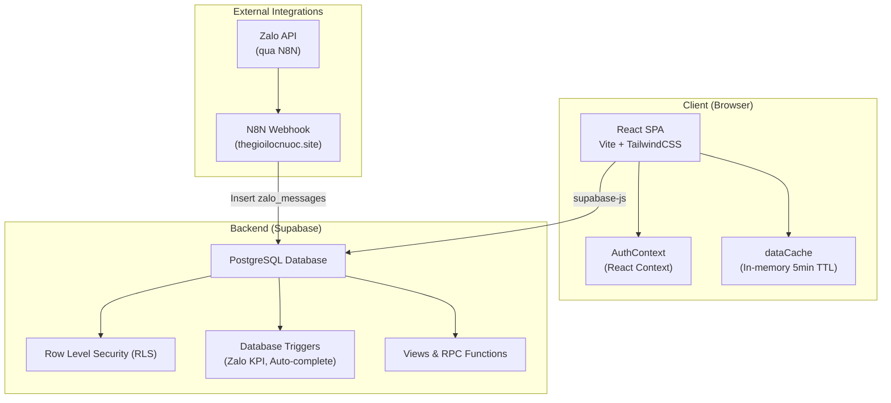
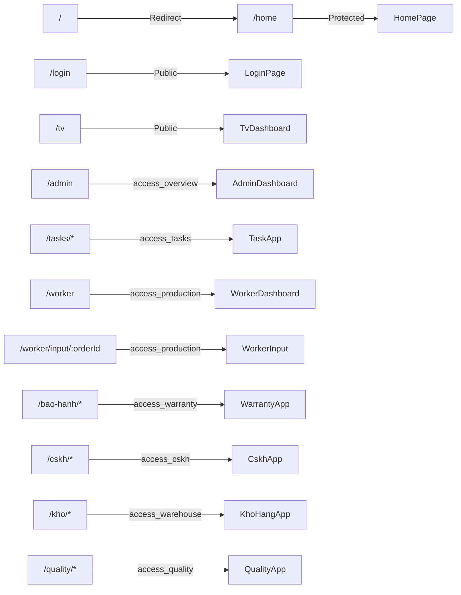
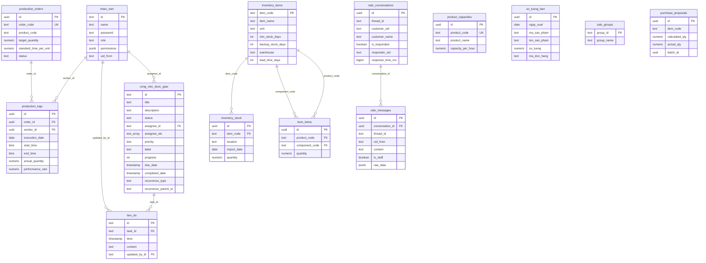
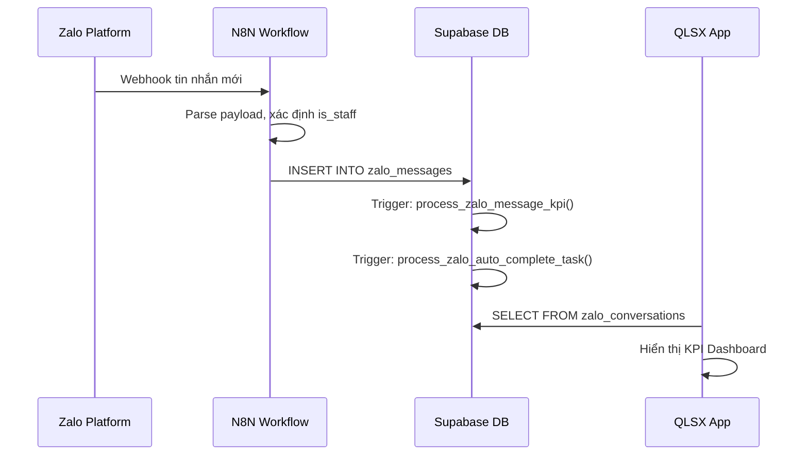

# 📋 Tổng Hợp Ngữ Cảnh Dự Án — QLSX App v3.0

> **Quản Lý Sản Xuất** — Ứng dụng web nội bộ quản lý toàn diện hoạt động sản xuất, công việc, kho hàng, bảo hành, chăm sóc khách hàng và chất lượng sản phẩm.

---

## 1. Tổng Quan Dự Án

| Thuộc tính | Chi tiết |
|---|---|
| **Tên ứng dụng** | QLSX App (Quản Lý Sản Xuất) |
| **Phiên bản** | v3.0 |
| **Loại ứng dụng** | Single Page Application (SPA) — Web App nội bộ |
| **Ngôn ngữ giao diện** | Tiếng Việt |
| **Mục đích** | Quản lý sản xuất, giao việc, theo dõi tiến độ, quản lý kho, bảo hành, CSKH, chất lượng sản phẩm |
| **Đối tượng sử dụng** | Nhân viên nội bộ (Admin, Nhân viên thường, Công nhân xưởng) |
| **Hosting** | Static hosting (Netlify/Cloudflare Pages) + Supabase Backend |
| **Thư mục gốc** | `d:\Báo cáo sản xuất\qlsx-app` |

---

## 2. Kiến Trúc Kỹ Thuật

### 2.1 Stack Công Nghệ

| Layer | Công nghệ | Phiên bản |
|---|---|---|
| **Frontend Framework** | React | 19.2.4 |
| **Build Tool** | Vite | 8.0.1 |
| **CSS Framework** | TailwindCSS | 4.2.2 |
| **Routing** | React Router DOM | 7.13.2 |
| **State Management** | React Context API + useState/useEffect |  |
| **Backend / Database** | Supabase (PostgreSQL) | 2.100.1 |
| **Icons** | Lucide React | 1.7.0 |
| **Charts** | Recharts | 3.8.1 |
| **Date Utilities** | date-fns | 4.1.0 |
| **Excel I/O** | SheetJS (xlsx) | 0.18.5 |
| **File Download** | file-saver | 2.0.5 |
| **ZIP** | jszip | 3.10.1 |
| **CSS Utilities** | clsx, tailwind-merge | |
| **Screenshot** | html2canvas (CDN) | 1.4.1 |

### 2.2 Sơ Đồ Kiến Trúc Tổng Thể



### 2.3 Mô Hình Dữ Liệu (Client-side)

- **Không sử dụng Redux/Zustand** — state quản lý bằng React hooks (`useState`, `useEffect`, `useCallback`)
- **AuthContext** ([AuthContext.jsx](file:///d:/Báo cáo sản xuất/qlsx-app/src/lib/AuthContext.jsx)): Context toàn app, quản lý user session, RBAC
- **dataCache** ([dataCache.js](file:///d:/Báo cáo sản xuất/qlsx-app/src/lib/dataCache.js)): In-memory cache singleton, TTL 5 phút, giảm API calls khi navigate giữa các tab
- **localStorage**: Lưu credentials đăng nhập (auto-login), các preference nhỏ

---

## 3. Hệ Thống Xác Thực & Phân Quyền (RBAC)

### 3.1 Cơ Chế Xác Thực

> [!IMPORTANT]
> App **KHÔNG** sử dụng Supabase Auth. Thay vào đó dùng **custom auth** — query trực tiếp bảng `nhan_vien` để xác thực.

**Luồng đăng nhập:**
1. User nhập **Mã nhân viên** + **Mật khẩu/PIN**
2. App query `nhan_vien` table: `SELECT * FROM nhan_vien WHERE id ILIKE :id AND password = :pw`
3. Nếu thành công → lưu credentials vào `localStorage` (key: `qlsx_auth`)
4. Auto-login: Khi mở app, đọc `localStorage` → tự đăng nhập lại

**Files liên quan:**
- [AuthContext.jsx](file:///d:/Báo cáo sản xuất/qlsx-app/src/lib/AuthContext.jsx) — Context provider, login/logout logic
- [Login.jsx](file:///d:/Báo cáo sản xuất/qlsx-app/src/pages/Login.jsx) — Trang đăng nhập
- [ProtectedRoute.jsx](file:///d:/Báo cáo sản xuất/qlsx-app/src/components/ProtectedRoute.jsx) — Route guard

### 3.2 Hệ Thống Phân Quyền (RBAC)

**2 tầng phân quyền:**

#### Tầng 1: Module-level (Quyền truy cập Phân hệ)

| Permission Key | Mô tả | Admin | NV mặc định |
|---|---|---|---|
| `access_overview` | Truy cập Tổng Quan / Sản Xuất | ✅ | ❌ |
| `access_tasks` | Truy cập Công Việc | ✅ | ✅ |
| `access_production` | Truy cập Nhập Liệu Sản Xuất | ✅ | ✅ |
| `access_warranty` | Truy cập Bảo Hành | ✅ | ❌ |
| `access_cskh` | Truy cập CSKH | ✅ | ❌ |
| `access_warehouse` | Truy cập Kho Hàng | ✅ | ❌ |
| `access_quality` | Truy cập Chất Lượng SP | ✅ | ❌ |

#### Tầng 2: Feature-level (Quyền tính năng chi tiết)

| Permission Key | Mô tả | Admin | NV mặc định |
|---|---|---|---|
| `view_dashboard` | Xem Tổng quan | ✅ | ❌ |
| `view_tasks` | Xem Công việc | ✅ | ✅ |
| `create_task` | Tạo việc mới | ✅ | ❌ |
| `edit_task` | Sửa công việc | ✅ | ❌ |
| `delete_task` | Xóa công việc | ✅ | ❌ |
| `edit_due_date` | Sửa thời hạn | ✅ | ❌ |
| `change_assignee` | Đổi người thực hiện | ✅ | ❌ |
| `edit_recurrence` | Sửa lặp lại | ✅ | ❌ |
| `change_status` | Đổi trạng thái | ✅ | ✅ |
| `add_update` | Cập nhật tiến độ | ✅ | ✅ |
| `cancel_task` | Hủy công việc | ✅ | ❌ |
| `remind_task` | Nhắc việc | ✅ | ❌ |
| `manage_users` | Quản lý nhân viên | ✅ | ❌ |
| `manage_settings` | Quản lý cài đặt | ✅ | ❌ |
| `zalo_kpi_view` | Xem KPI CSKH Zalo | ✅ | ❌ |
| `zalo_kpi_mark_done` | Đánh dấu đã xử lý (Zalo) | ✅ | ❌ |
| `zalo_kpi_delete` | Xóa dữ liệu KPI Zalo | ✅ | ❌ |
| `zalo_kpi_filter` | Lọc nâng cao KPI Zalo | ✅ | ❌ |
| `zalo_kpi_export` | Xuất Excel KPI Zalo | ✅ | ❌ |

**Cơ chế:**
- Admin (`role = 'ADMIN'`): Có tất cả quyền, không cần check
- Nhân viên thường: Quyền mặc định + quyền custom lưu trong field `permissions` (JSONB) của bảng `nhan_vien`
- Hàm `getUserPerms(user)` merge quyền mặc định với quyền custom đã lưu

---

## 4. Routing & Cấu Trúc Module

### 4.1 Sơ Đồ Route



### 4.2 Danh Sách 8 Phân Hệ

| # | Phân hệ | Route | Icon | Màu | File chính |
|---|---|---|---|---|---|
| 1 | **Tổng Quan** | `/admin` | BarChart2 | 🔵 #2563eb | [AdminDashboard.jsx](file:///d:/Báo cáo sản xuất/qlsx-app/src/pages/AdminDashboard.jsx) |
| 2 | **Công Việc** | `/tasks/*` | ClipboardList | 🟣 #6366f1 | [TaskApp.jsx](file:///d:/Báo cáo sản xuất/qlsx-app/src/pages/tasks/TaskApp.jsx) |
| 3 | **Sản Xuất** | `/worker` | Package | 🔷 #0891b2 | [WorkerDashboard.jsx](file:///d:/Báo cáo sản xuất/qlsx-app/src/pages/WorkerDashboard.jsx), [WorkerInput.jsx](file:///d:/Báo cáo sản xuất/qlsx-app/src/pages/WorkerInput.jsx) |
| 4 | **Bảo Hành** | `/bao-hanh/*` | ShieldAlert | 🔴 #ef4444 | [WarrantyApp.jsx](file:///d:/Báo cáo sản xuất/qlsx-app/src/pages/warranty/WarrantyApp.jsx) |
| 5 | **CSKH** | `/cskh/*` | HeadphonesIcon | 🟣 #8b5cf6 | [CskhApp.jsx](file:///d:/Báo cáo sản xuất/qlsx-app/src/pages/cskh/CskhApp.jsx) |
| 6 | **Kho Hàng** | `/kho/*` | Warehouse | 🟢 #0d9488 | [KhoHangApp.jsx](file:///d:/Báo cáo sản xuất/qlsx-app/src/pages/kho/KhoHangApp.jsx) |
| 7 | **CL Sản Phẩm** | `/quality/*` | ShieldCheck | 🟢 #16a34a | [QualityApp.jsx](file:///d:/Báo cáo sản xuất/qlsx-app/src/pages/quality/QualityApp.jsx) |
| 8 | **Màn Hình TV** | `/tv` | MonitorPlay | ⚫ #475569 | [TvDashboard.jsx](file:///d:/Báo cáo sản xuất/qlsx-app/src/pages/TvDashboard.jsx) |

---

## 5. Chi Tiết Từng Phân Hệ

### 5.1 📊 Phân Hệ Tổng Quan (AdminDashboard)

**File:** [AdminDashboard.jsx](file:///d:/Báo cáo sản xuất/qlsx-app/src/pages/AdminDashboard.jsx) (~985 dòng, ~61KB)

**Chức năng chính:**
- **Dashboard tổng quan**: Stats cards (Lệnh đã giao, Nhật ký mới, Hiệu suất TB, Số nhân viên)
- **Quản lý Năng lực SX / Mã Sản phẩm**: CRUD định mức thời gian chuẩn (Giờ/SP), import Excel, download template
- **Quản lý Lệnh Sản Xuất**: Tạo/import lệnh từ Excel, theo dõi tiến độ (Mục tiêu vs Đã tích luỹ vs Còn lại)
- **Phân Tích Báo Cáo Sản Xuất**: Bộ lọc thời gian (Hôm nay/Hôm qua/Tuần/Tháng/Năm), so sánh cùng kỳ, trend cá nhân
- **Báo Cáo Công Việc**: Tổng hợp sản xuất + công việc nội bộ theo nhân viên, xếp hạng Top, rate đúng hạn
- **Bảng Tiến Độ Sản Xuất**: Timeline chart (8h-21h) hiển thị khối thời gian làm việc theo ngày

**Tối ưu hiệu suất:**
- `rawData` pattern: Fetch 1 lần, derive mọi nơi (không gọi API khi đổi filter)
- `dataCache` singleton với TTL 5 phút

**Tabs:** `menu` | `overview` | `capacities` | `orders` | `timeline`

---

### 5.2 📋 Phân Hệ Công Việc (TaskApp)

**File:** [TaskApp.jsx](file:///d:/Báo cáo sản xuất/qlsx-app/src/pages/tasks/TaskApp.jsx) (~94KB)
**File phụ:** [WorkReport.jsx](file:///d:/Báo cáo sản xuất/qlsx-app/src/pages/tasks/WorkReport.jsx) (~46KB)

**Chức năng chính:**
- **CRUD Công việc**: Tạo, sửa, xóa, gán người thực hiện
- **Việc nhóm (07/2026)**: Một việc giao được cho **nhiều NV** qua cột `assignee_ids text[]`.
  `assignee_id` cũ vẫn còn và luôn `= assignee_ids[1]` (người đại diện), do trigger
  `sync_task_assignees` canh giữ → các query cũ chưa đổi vẫn chạy đúng (thấy người đại diện).
  Mọi chỗ hiển thị (kể cả TvDashboard, báo cáo) đã đổi để liệt kê **đủ** thành viên, không rút gọn.
  Luật: **ai xong trước là xong cả nhóm**; báo cáo tính cho **mọi** thành viên có tên trong nhóm
  (nên tổng cộng dồn theo từng NV lớn hơn tổng toàn công ty — đúng thiết kế, không phải lỗi).
  Đọc nhóm **luôn qua `memberIds()`** (`src/lib/taskAssignees.js`), đừng đọc thẳng `assignee_id`.
  Đổi mã NV phải gọi RPC `doi_ma_nv_trong_viec` (vá cả thành viên không phải đại diện).
  Script DB: `sql/setup_task_multi_assignee.sql`.
  > ⚠️ **Thứ tự bắt buộc: chạy SQL TRƯỚC, deploy bundle SAU.** Bundle mới ghi cột `assignee_ids`
  > ở mọi lần tạo/sửa việc; lên trước SQL thì PostgREST trả `PGRST204 Could not find the
  > 'assignee_ids' column` → **cả công ty không tạo/sửa được việc nào**. Chiều ngược lại
  > (SQL trước, bundle cũ còn chạy) thì an toàn nhờ nhánh fallback của `memberIds()`.
- **Trạng thái**: `IN_PROGRESS` → `COMPLETED` / `CANCELLED`
- **Lặp lại (Recurrence)**: `NONE`, `DAILY`, `WEEKLY`, `MONTHLY` — tự động tạo instance mới
- **Tiến độ (Progress Updates)**: Ghi nhận cập nhật, comment theo dòng thời gian
- **Nhắc việc**: Gửi nhắc nhở qua webhook N8N
- **Quản lý nhân viên**: CRUD nhân viên, phân quyền chi tiết
- **Webhook N8N**: Gửi thông báo tới `https://thegioilocnuoc.site/webhook/...`

**API Layer:** [task_api.js](file:///d:/Báo cáo sản xuất/qlsx-app/src/lib/task_api.js) — Các hàm `apiCreateTask`, `apiUpdateTask`, `apiDeleteTask`, `apiAddUpdate`, `checkRecurring`, `callWebhook`

**ID Convention:** `CV-001`, `CV-002`... (Công việc), `TD-001`... (Tiến độ)

---

### 5.3 🏭 Phân Hệ Sản Xuất (Worker)

**Files:**
- [WorkerDashboard.jsx](file:///d:/Báo cáo sản xuất/qlsx-app/src/pages/WorkerDashboard.jsx) — Danh sách lệnh SX đang active
- [WorkerInput.jsx](file:///d:/Báo cáo sản xuất/qlsx-app/src/pages/WorkerInput.jsx) (~29KB) — Form nhập liệu sản xuất

**Chức năng chính:**
- Hiển thị danh sách Lệnh SX còn pending/in_progress (chỉ hiện lệnh chưa hoàn thành)
- Cho phép công nhân chọn Lệnh → Nhập số lượng thực tế, thời gian bắt đầu/kết thúc
- Tự động tính **hiệu suất** (performance_rate) dựa trên định mức năng lực
- Hiển thị: Chỉ tiêu / Đã nhập / Còn lại cho mỗi lệnh

---

### 5.4 🛡️ Phân Hệ Bảo Hành (Warranty)

**Files:**
- [WarrantyApp.jsx](file:///d:/Báo cáo sản xuất/qlsx-app/src/pages/warranty/WarrantyApp.jsx) (~48KB)
- [WarrantyDataManager.jsx](file:///d:/Báo cáo sản xuất/qlsx-app/src/pages/warranty/WarrantyDataManager.jsx) (~44KB) — Quản lý dữ liệu bảo hành
- [BatchAnalytics.jsx](file:///d:/Báo cáo sản xuất/qlsx-app/src/pages/warranty/BatchAnalytics.jsx) (~44KB) — Phân tích theo lô

**Chức năng chính:**
- Theo dõi và phân tích dữ liệu bảo hành sản phẩm
- Quản lý dữ liệu bảo hành (import/export)
- Phân tích analytics theo batch/lô sản phẩm

---

### 5.5 🎧 Phân Hệ CSKH (Chăm Sóc Khách Hàng)

**Files:**
- [CskhApp.jsx](file:///d:/Báo cáo sản xuất/qlsx-app/src/pages/cskh/CskhApp.jsx) (~14KB) — Shell chính
- [CskhDashboard.jsx](file:///d:/Báo cáo sản xuất/qlsx-app/src/pages/cskh/CskhDashboard.jsx) (~14KB) — Dashboard tổng quan
- [ZaloKpiTab.jsx](file:///d:/Báo cáo sản xuất/qlsx-app/src/pages/cskh/ZaloKpiTab.jsx) (~63KB) — Tab KPI Zalo chính

**Chức năng chính:**
- **KPI Zalo**: Theo dõi tốc độ phản hồi tin nhắn Zalo từ khách hàng
- **Dashboard**: Thống kê tổng quan phản hồi, tỉ lệ xử lý
- **Báo cáo**: Xuất báo cáo KPI theo nhân viên, nhóm Zalo
- **Đánh dấu xử lý**: Mark as responded, ghi nhận người phản hồi

> ⛔ **Đã gỡ (07/2026): "BC Trực Zalo (thủ công)"** — `ZaloReportTab.jsx`, `ZaloReportModal.jsx`,
> nút "Gửi BC Zalo" (ở cả TaskApp và CSKH), quyền tab `zalo_report`, bảng `zalo_duty_reports`
> và bucket `zalo-reports`. Không dùng nữa. Script gỡ DB: `sql/drop_zalo_reports.sql`.
> **KPI CSKH Zalo và hệ thống nhắc việc Zalo KHÔNG bị ảnh hưởng.**

---

### 5.6 🏪 Phân Hệ Kho Hàng (KhoHangApp)

**File chính:** [KhoHangApp.jsx](file:///d:/Báo cáo sản xuất/qlsx-app/src/pages/kho/KhoHangApp.jsx) (~50KB)

**14 Tab con:**

| Tab | File | Chức năng |
|---|---|---|
| Danh mục hàng hóa | [CatalogTab.jsx](file:///d:/Báo cáo sản xuất/qlsx-app/src/pages/kho/CatalogTab.jsx) | Quản lý danh mục mã hàng |
| BOM Sản Xuất | [BomTab.jsx](file:///d:/Báo cáo sản xuất/qlsx-app/src/pages/kho/BomTab.jsx) | Bill of Materials — linh kiện cho từng thành phẩm |
| Tồn kho thực tế | [InventoryTab.jsx](file:///d:/Báo cáo sản xuất/qlsx-app/src/pages/kho/InventoryTab.jsx) | Quản lý tồn kho (vị trí, ngày nhập, số lượng) |
| Sổ kiểm kho | [BookInventoryTab.jsx](file:///d:/Báo cáo sản xuất/qlsx-app/src/pages/kho/BookInventoryTab.jsx) | Kiểm kê và đối chiếu |
| Nhập kho | [ImportStockTab.jsx](file:///d:/Báo cáo sản xuất/qlsx-app/src/pages/kho/ImportStockTab.jsx) | Ghi nhận nhập kho |
| Lịch sử nhập | [ImportLogsTab.jsx](file:///d:/Báo cáo sản xuất/qlsx-app/src/pages/kho/ImportLogsTab.jsx) | Log lịch sử nhập kho |
| Lệnh sản xuất | [ProductionOrderTab.jsx](file:///d:/Báo cáo sản xuất/qlsx-app/src/pages/kho/ProductionOrderTab.jsx) | Quản lý lệnh SX từ góc kho (~76KB, tab lớn nhất) |
| Lưu xuất | [SaveExportTab.jsx](file:///d:/Báo cáo sản xuất/qlsx-app/src/pages/kho/SaveExportTab.jsx) | Lưu phiếu xuất kho |
| Đề xuất mua hàng | [OrderProposalTab.jsx](file:///d:/Báo cáo sản xuất/qlsx-app/src/pages/kho/OrderProposalTab.jsx) | Đề xuất mua nguyên vật liệu |
| Tổng hợp tồn | [StockSummaryTab.jsx](file:///d:/Báo cáo sản xuất/qlsx-app/src/pages/kho/StockSummaryTab.jsx) | Tổng hợp số liệu tồn kho |
| WIP Stock | [WipStockTab.jsx](file:///d:/Báo cáo sản xuất/qlsx-app/src/pages/kho/WipStockTab.jsx) | Hàng tồn Work-in-Progress |
| Hàng đợi in | [PrintQueueTab.jsx](file:///d:/Báo cáo sản xuất/qlsx-app/src/pages/kho/PrintQueueTab.jsx) | Quản lý hàng đợi in phiếu |
| Log soạn hàng | [PickingLogsTab.jsx](file:///d:/Báo cáo sản xuất/qlsx-app/src/pages/kho/PickingLogsTab.jsx) | Lịch sử picking/soạn hàng |

---

### 5.7 ✅ Phân Hệ Chất Lượng Sản Phẩm (Quality)

**File:** [QualityApp.jsx](file:///d:/Báo cáo sản xuất/qlsx-app/src/pages/quality/QualityApp.jsx) (~79KB)

**Chức năng chính:**
- Ghi nhận lỗi chất lượng sản phẩm
- Phân tích và đối sách (countermeasures)
- Theo dõi và báo cáo chất lượng

---

### 5.8 📺 Phân Hệ Màn Hình TV (TvDashboard)

**File:** [TvDashboard.jsx](file:///d:/Báo cáo sản xuất/qlsx-app/src/pages/TvDashboard.jsx) (~17KB)

**Chức năng chính:**
- **Hiển thị fullscreen** trên TV xưởng — màn hình tối, font lớn
- **Theo dõi công việc real-time**: Hiển thị danh sách công việc đang chờ (status ≠ COMPLETED/CANCELLED)
- **Countdown timer**: Hiển thị thời gian còn lại / quá hạn cho từng công việc
- **Hệ thống chuông báo động** (Web Audio API):
  - Kích hoạt khi công việc còn ≤ 15 phút hoặc quá hạn
  - 8 loại chuông: Còi hú, Cảnh sát, Cứu hỏa, Trống, Sét, Sư tử gầm, Bíp, Chuông
  - Lặp lại mỗi 5 giây khi có nguy hiểm
- **Visual alarm**: Nền nhấp nháy đỏ-vàng khi có công việc sắp quá hạn
- **Public route**: Không cần đăng nhập, ai cũng truy cập được
- Refresh dữ liệu mỗi 60 giây

---

## 6. Database Schema (Supabase PostgreSQL)

### 6.1 Sơ Đồ Tổng Quan Các Bảng



### 6.2 Danh Sách Bảng Chi Tiết

| # | Bảng | Mô tả | SQL File |
|---|---|---|---|
| 1 | `nhan_vien` | Nhân viên / Users — auth & RBAC | *(trong app, không có file SQL riêng)* |
| 2 | `cong_viec_duoc_giao` | Công việc được giao | *(trong app)* |
| 3 | `tien_do` | Tiến độ / Progress updates | *(trong app)* |
| 4 | `workers` | Bảng nhân sự cũ (legacy) | [supabase_schema.sql](file:///d:/Báo cáo sản xuất/qlsx-app/sql/supabase_schema.sql) |
| 5 | `production_orders` | Lệnh sản xuất | [supabase_schema.sql](file:///d:/Báo cáo sản xuất/qlsx-app/sql/supabase_schema.sql) |
| 6 | `production_logs` | Nhật ký sản xuất | [supabase_schema.sql](file:///d:/Báo cáo sản xuất/qlsx-app/sql/supabase_schema.sql) |
| 7 | `product_capacities` | Định mức năng lực SX | [supabase_schema.sql](file:///d:/Báo cáo sản xuất/qlsx-app/sql/supabase_schema.sql) |
| 8 | `so_luong_ban` | Số lượng bán (730K+ rows) | [supabase_schema.sql](file:///d:/Báo cáo sản xuất/qlsx-app/sql/supabase_schema.sql) |
| 9 | `inventory_items` | Danh mục hàng hóa | [setup_kho_schema.sql](file:///d:/Báo cáo sản xuất/qlsx-app/sql/setup_kho_schema.sql) |
| 10 | `bom_items` | BOM Sản xuất | [setup_kho_schema.sql](file:///d:/Báo cáo sản xuất/qlsx-app/sql/setup_kho_schema.sql) |
| 11 | `inventory_stock` | Tồn kho thực tế | [setup_kho_schema.sql](file:///d:/Báo cáo sản xuất/qlsx-app/sql/setup_kho_schema.sql) |
| 12 | `zalo_conversations` | Phiên hội thoại Zalo (gom 5 phút) | [setup_zalo_kpi.sql](file:///d:/Báo cáo sản xuất/qlsx-app/sql/setup_zalo_kpi.sql) |
| 13 | `zalo_messages` | Tin nhắn Zalo raw | [setup_zalo_kpi.sql](file:///d:/Báo cáo sản xuất/qlsx-app/sql/setup_zalo_kpi.sql) |
| 14 | `zalo_groups` | Danh mục nhóm Zalo | [setup_zalo_groups.sql](file:///d:/Báo cáo sản xuất/qlsx-app/sql/setup_zalo_groups.sql) |
| 15 | `purchase_proposals` | Đề xuất mua hàng | [setup_purchase_proposals.sql](file:///d:/Báo cáo sản xuất/qlsx-app/sql/setup_purchase_proposals.sql) |
| 16 | `cong_viec_duoc_giao.assignee_ids` | Cột việc nhóm + trigger đồng bộ người đại diện + RPC đổi mã NV | [setup_task_multi_assignee.sql](file:///d:/Báo cáo sản xuất/qlsx-app/sql/setup_task_multi_assignee.sql) |

### 6.3 Views

| View | Mô tả |
|---|---|
| `view_thong_ke_ban_hang` | Thống kê doanh số bán hàng (gom theo tháng + mã SP) — giảm tải 730K+ rows |

### 6.4 Database Triggers & Functions

| Trigger | Bảng | Timing | Chức năng |
|---|---|---|---|
| `trigger_zalo_kpi_process` | `zalo_messages` | BEFORE INSERT | Tự động gom tin nhắn khách hàng thành phiên hội thoại (5 phút), ghi nhận KPI phản hồi nhân viên |
| `trigger_zalo_auto_complete_task` | `zalo_messages` | AFTER INSERT | Tự động hoàn thành task "Báo cáo công việc cuối ngày" khi nhân viên gửi báo cáo vào nhóm Zalo đích (việc nhóm: **ai trong nhóm gửi cũng đóng được**) |
| `trigger_sync_task_assignees` | `cong_viec_duoc_giao` | BEFORE INSERT/UPDATE | Canh bất biến `assignee_id = assignee_ids[1]` cho việc nhóm; ghi kiểu cũ (chỉ `assignee_id`) vẫn hợp lệ |

**Logic Trigger Zalo KPI:**
1. **Khách hàng nhắn tin**: Kiểm tra có phiên mở trong 5 phút → gom vào hoặc tạo phiên mới
2. **Nhân viên trả lời**: Tìm UID khách từ quote/mention → đánh dấu `is_responded = true`, tính `response_time_ms`

**Logic Auto-complete Task:**
- Thread đích: `6274675927160413910`
- Điều kiện: Content chứa "em gửi báo cáo" hoặc "em báo cáo" (case-insensitive)
- Hành động: Tìm task "Báo cáo công việc cuối ngày" của nhân viên → set COMPLETED + tạo log tiến độ

---

## 7. Tích Hợp Bên Ngoài

### 7.1 Zalo Integration



- **N8N Webhook endpoint**: `https://thegioilocnuoc.site/webhook/47cc5412-40b2-4747-af7f-8d7090cb40c2`
- **Luồng dữ liệu**: Zalo → N8N → Supabase (trigger) → App đọc

### 7.2 N8N Webhook (Task Notifications)

- App gửi notification tới N8N khi tạo/nhắc/hoàn thành công việc
- Hàm `callWebhook(payload)` trong [task_api.js](file:///d:/Báo cáo sản xuất/qlsx-app/src/lib/task_api.js)

---

## 8. Cấu Trúc Thư Mục Dự Án

```
qlsx-app/
├── 📄 .env                          # Supabase URL + Anon Key
├── 📄 index.html                    # Entry point (title: "Sản Xuất & Giao Việc")
├── 📄 package.json                  # Dependencies & scripts
├── 📄 vite.config.js                # Vite + TailwindCSS + React plugin
├── 📂 public/
│   ├── _redirects                   # SPA fallback (Netlify)
│   ├── favicon.svg
│   └── icons.svg
├── 📂 sql/                          # 36 SQL migration files
│   ├── supabase_schema.sql          # Schema gốc (workers, orders, logs, capacities, so_luong_ban)
│   ├── setup_kho_schema.sql         # Schema Kho (inventory, BOM, stock)
│   ├── setup_zalo_kpi.sql           # Schema Zalo KPI + Trigger
│   ├── setup_zalo_groups.sql        # Bảng nhóm Zalo + Trigger v2
│   ├── setup_auto_complete_task.sql # Trigger auto-complete task từ Zalo
│   ├── setup_purchase_proposals.sql # Bảng đề xuất mua hàng
│   ├── update_media_parser_v*.sql   # 13 phiên bản media parser (v1-v13)
│   └── ... (các file migration khác)
├── 📂 src/
│   ├── 📄 main.jsx                  # ReactDOM.render + Providers
│   ├── 📄 App.jsx                   # React Router routes
│   ├── 📄 index.css                 # Global styles + TailwindCSS
│   ├── 📂 lib/                      # Shared utilities
│   │   ├── AuthContext.jsx          # 🔐 Auth + RBAC Context
│   │   ├── supabase.js              # Supabase client (main)
│   │   ├── task_supabase.js         # Supabase client (tasks)
│   │   ├── task_api.js              # Task CRUD API layer
│   │   ├── dataCache.js             # In-memory cache (5min TTL)
│   │   ├── dateUtils.js             # Date helpers
│   │   └── usePersistedState.js     # Custom hook: state + localStorage
│   ├── 📂 components/               # Reusable UI components
│   │   ├── ModuleShell.jsx          # Layout wrapper cho mỗi phân hệ
│   │   ├── ProtectedRoute.jsx       # Auth guard + permission check
│   │   ├── DateRangeDropdown.jsx    # Date filter dropdown (modal)
│   │   ├── SearchAutoSuggest.jsx    # Multi-select search with autocomplete
│   │   └── WarehouseSharedUI.jsx    # Shared UI cho phân hệ Kho
│   ├── 📂 pages/                    # Page-level components
│   │   ├── Login.jsx                # Trang đăng nhập
│   │   ├── HomePage.jsx             # Trang chủ (grid 8 phân hệ)
│   │   ├── AdminDashboard.jsx       # Phân hệ Tổng Quan
│   │   ├── WorkerDashboard.jsx      # Phân hệ Sản Xuất (danh sách lệnh)
│   │   ├── WorkerInput.jsx          # Form nhập liệu sản xuất
│   │   ├── TvDashboard.jsx          # Màn hình TV theo dõi
│   │   ├── 📂 tasks/                # Module Công Việc
│   │   │   ├── TaskApp.jsx          # App chính
│   │   │   └── WorkReport.jsx       # Báo cáo công việc
│   │   ├── 📂 warranty/             # Module Bảo Hành
│   │   │   ├── WarrantyApp.jsx
│   │   │   ├── WarrantyDataManager.jsx
│   │   │   └── BatchAnalytics.jsx
│   │   ├── 📂 cskh/                 # Module CSKH
│   │   │   ├── CskhApp.jsx
│   │   │   ├── CskhDashboard.jsx
│   │   │   └── ZaloKpiTab.jsx
│   │   ├── 📂 kho/                  # Module Kho Hàng (14 tabs)
│   │   │   ├── KhoHangApp.jsx
│   │   │   ├── CatalogTab.jsx
│   │   │   ├── BomTab.jsx
│   │   │   ├── InventoryTab.jsx
│   │   │   ├── BookInventoryTab.jsx
│   │   │   ├── ImportStockTab.jsx
│   │   │   ├── ImportLogsTab.jsx
│   │   │   ├── ProductionOrderTab.jsx
│   │   │   ├── SaveExportTab.jsx
│   │   │   ├── OrderProposalTab.jsx
│   │   │   ├── StockSummaryTab.jsx
│   │   │   ├── WipStockTab.jsx
│   │   │   ├── PrintQueueTab.jsx
│   │   │   └── PickingLogsTab.jsx
│   │   └── 📂 quality/              # Module Chất Lượng
│   │       └── QualityApp.jsx
│   └── 📂 assets/                   # Static assets
├── 📂 dist/                         # Production build output
├── 📄 deploy.zip                    # Deployment package
└── 📄 *.cjs                         # Utility scripts (check, count, verify...)
```

---

## 9. Scripts Utility (Root-level .cjs files)

| File | Mục đích |
|---|---|
| `check.cjs`, `check2.cjs` | Scripts kiểm tra dữ liệu DB |
| `check_xuyen.cjs` | Kiểm tra dữ liệu xuyên bảng |
| `check_xuyen_is_staff.cjs` | Kiểm tra flag `is_staff` |
| `check_xuyen_reply.cjs` | Kiểm tra dữ liệu reply |
| `count.cjs`, `count2.cjs` | Đếm records |
| `fix_xuyen_uid.cjs` | Fix dữ liệu UID |
| `print.cjs` | In dữ liệu debug |
| `trace.cjs` | Tracing/debug |
| `verify_zalo_kpi.cjs` | Xác minh dữ liệu KPI Zalo |

---

## 10. Cấu Hình & Môi Trường

### 10.1 Environment Variables

```env
VITE_SUPABASE_URL=https://ngwkzicrnspeggunsblr.supabase.co
VITE_SUPABASE_ANON_KEY=eyJhbGc...
```

### 10.2 Supabase Configuration

- **Project Ref**: `ngwkzicrnspeggunsblr`
- **Region**: (mặc định)
- **RLS**: Enabled nhưng policy cho phép toàn quyền (`FOR ALL USING (true)`) — phù hợp cho ứng dụng nội bộ
- **Custom fetch**: Timeout 10 giây, xử lý khi Supabase project bị pause

### 10.3 Build & Deploy

```bash
# Development
npm run dev          # Vite dev server

# Production build
npm run build        # Output → dist/

# Deploy
# SPA routing: _redirects file (/* → /index.html 200)
```

---

## 11. Patterns & Conventions

### 11.1 Coding Patterns

| Pattern | Mô tả |
|---|---|
| **rawData + derive** | Fetch dữ liệu 1 lần, derive mọi báo cáo/filter từ cache (AdminDashboard) |
| **dataCache singleton** | In-memory cache xuyên suốt navigation, TTL 5 phút |
| **ModuleShell wrapper** | Layout chuẩn cho mỗi phân hệ (header, tabs, refresh, home button) |
| **Inline styles** | Phần lớn components dùng inline `style={{}}` object, một số dùng TailwindCSS classes |
| **ILIKE cho ID** | Đăng nhập dùng `ILIKE` (case-insensitive) cho mã nhân viên |
| **ID generation** | Custom sequential ID: `CV-001`, `TD-001` (không dùng UUID cho task/progress) |
| **Modal lock** | `document.body.style.overflow = 'hidden'` khi mở modal (fix mobile scroll) |

### 11.2 Naming Conventions

| Loại | Convention | Ví dụ |
|---|---|---|
| Components | PascalCase | `AdminDashboard`, `ZaloKpiTab` |
| Files (pages) | PascalCase.jsx | `WorkerDashboard.jsx` |
| Files (lib) | camelCase.js | `dataCache.js`, `task_api.js` |
| DB Tables | snake_case (Vietnamese) | `nhan_vien`, `cong_viec_duoc_giao`, `so_luong_ban` |
| DB Columns | snake_case | `assignee_id`, `due_date`, `is_responded` |
| Permissions | snake_case | `access_overview`, `zalo_kpi_view` |

---

## 12. Tổng Hợp Kích Thước Files

> [!NOTE]
> Các file lớn nhất thường chứa nhiều logic nghiệp vụ phức tạp, cần chú ý khi refactor.

| File | Kích thước | Ghi chú |
|---|---|---|
| `TaskApp.jsx` | ~94 KB | Module công việc đầy đủ |
| `QualityApp.jsx` | ~79 KB | Module chất lượng SP |
| `ProductionOrderTab.jsx` | ~76 KB | Tab lệnh SX trong kho |
| `ZaloKpiTab.jsx` | ~63 KB | Tab KPI Zalo |
| `AdminDashboard.jsx` | ~61 KB | Dashboard tổng quan |
| `KhoHangApp.jsx` | ~50 KB | Shell kho hàng |
| `WarrantyApp.jsx` | ~48 KB | Module bảo hành |
| `WorkReport.jsx` | ~46 KB | Báo cáo công việc |
| `BatchAnalytics.jsx` | ~44 KB | Phân tích theo lô |
| `WarrantyDataManager.jsx` | ~44 KB | Quản lý data bảo hành |

---

## 13. Lưu Ý Quan Trọng

> [!WARNING]
> - App dùng **custom auth** (không phải Supabase Auth) — mật khẩu lưu plain-text trong DB
> - RLS policy mở toàn quyền (`USING (true)`) — chỉ phù hợp cho ứng dụng nội bộ
> - Bảng `so_luong_ban` có **730,000+ rows** — đã tạo View `view_thong_ke_ban_hang` để giảm tải
> - 2 Supabase client instances: `supabase` (main) và `taskDb` (tasks) — cùng kết nối đến 1 project

> [!CAUTION]
> - File `.env` chứa Supabase Anon Key — đây là key public, nhưng kết hợp RLS mở nên cần cẩn thận
> - Các utility scripts `.cjs` ở root chứa Supabase keys hardcoded
> - Không có TypeScript — toàn bộ là JavaScript + JSX

---

*Tài liệu được tạo tự động ngày 01/06/2026. Cập nhật khi có thay đổi cấu trúc dự án.*
